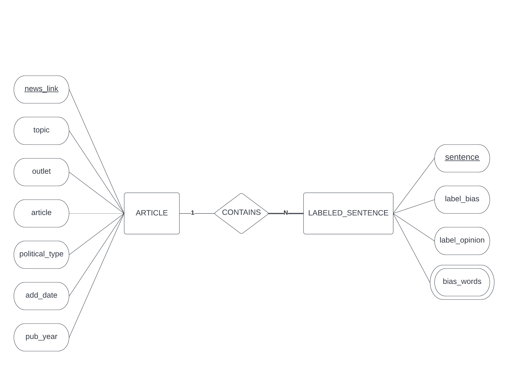
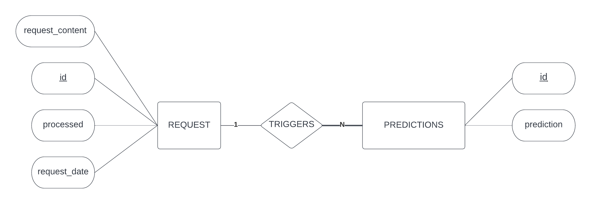
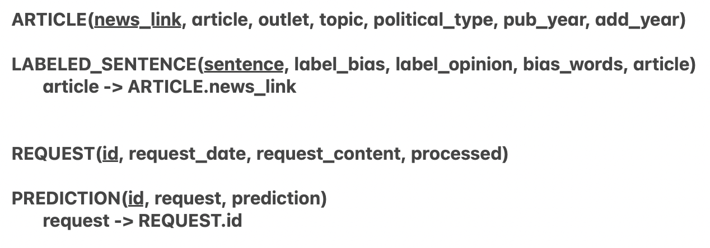

# Neeva - News bias evaluator

## Description

The main goal of the system is to provide a simple and efficient way to determine whether text from news articles potentially contain some form of bias.

The system uses machine learning to evaluate each sentence of a text and return a score as well as an evaluation for each sentence. More details are provided in the **Machine Learning Concept** section.

## User interaction
 
### Users: 
 
**To get an analysis on text, follow these steps:** 
 
- On the application’s home screen, enter the text you wish to analyze into the text field. 
- Click the submit button located at the bottom of the text field. (This will redirect the page) 
 
Screenshot of the above mentioned steps. 


 
Once redirected, an analysis of the text input will be displayed, as follows. 


The analysis includes the following: 
 
- On the top left, the input has been broken down into individual sentences which are then analyzed individually.	 
- On the top right, the bias prediction results are displayed with the probability of the result from each sentence as well as a description explaining the prediction. 
- On the bottom left, the analysis of the sentence shows how the prediction results were affected by each word in the given sentence. 
 
### Information:
 
To get information on the model, the dataset and how we train the model, click the info button on the top right, which will trigger a popup window as follows: 
 


To view the source code, click the github icon on the top right, which will redirect you to our github repository. 
 
### Admin: 
 
To login as an admin, click the admin login button on the top left corner, this will redirect you to a login page*. <br/>
<sub>* *Please note that you will need existing admin credentials to access the admin dashboard.*</sub> 
 
Once logged in, you will be presented with the admin dashboard as follows: 
 


**The admin dashboard contains the following:** 

- A drop-down list of the model’s versions currently available, this list is fetched from google cloud in order to keep it up to date. 
- A drop-down list of actions the admin can choose to perform on the selected model version. 
- An option to upload a csv file. 
 
**To select a model version to use for predictions:** 
 
- Select a model version from the first drop-down list. 
- Select the option ‘set as active’ from the second drop-down list. 
- Click the start button. 
 
If successful, a success message should be displayed at the top of the page. This will now be the model prediction requests are sent to. 
 
**To evaluate a model:** 
 
- Select a model version from the first drop-down list.	 
- Select the option ‘evaluate’ from the second drop-down list. 
- Click the start button. 
 
 
This will redirect you to the evaluation page as follows: 
 

 
**To retrain a model:** 
 
- Select a model version from the first drop-down list. 
- Select the option ‘retrain’ from the second drop-down list. 
- Click the start button. 
 
This will redirect you to the retraining page, a training job will automatically be started and the following can occur: 
 
**The retraining job was successful:** 
 
In both cases below, an evaluation comparison is displayed, this includes a confusion matrix and accuracy, recall, precision and f1 metrics for both models. 

If the newly trained model evaluation is better than the current model, the admin will be presented with the option to deploy the model or cancel the deployment, as follows: 
 

 
If the newly trained model evaluation is worse than the current model, the admin will not be able to deploy it. 
 
**The retraining job failed:** 
 
An error icon and message will be displayed and no evaluation comparison will appear. 


## Major Dependencies

| Dependency | Version | 
| --- | --- | 
| [Django](https://www.djangoproject.com/download/) | `4.1` |
| [Scikit-learn](https://scikit-learn.org/stable/) | `1.1.3` | 
| [Pandas](https://pandas.pydata.org) | `1.5.1` | 
| [Tensorflow](https://www.tensorflow.org/?hl=en) | `2.9` | 
| [Docker](https://www.docker.com) | `20.10.17` |


---

## Machine Learning Concept

### Original dataset

Data source
Planned data source:

> https://www.kaggle.com/datasets/timospinde/mbic-a-media-bias-annotation-dataset

This data source in particular was chosen due to the process of labelling  the dataset
adhered to determining if text is biassed can be subjective and dependent on the views of
who is labelling the data. This dataset takes the human-labelling approach, specifically , 10
annotators reviewed each entry and the identification of bias was based on the individual
words and sentence as a whole. Furthermore, this dataset provides information on
characteristics and the background of its 1345 annotators. Due to these conditions, we
believe that the labelling process leads to the creation of a reliable source that can be used
to make accurate predictions.

### Retraining the model

Due to the size of the dataset (1700), we aim to use semi-supervised learning to increase our dataset.
We will gather more articles and once we have enough collected data, we will use the
current model to label the sentences within these articles. The sentences with a high
accuracy will then be added to the training dataset. The sentences  with  a low accuracy will
be added to the testing dataset and will be tested on the new model, which will help us
determine the impact of the newly added data on the model. This evaluation will be the
deciding factor in whether we update the model or keep the existing version. We would
need to extract all the features from the new data, which would lead to arduousness in our
monitoring stage. The features we select for our initial model will be influenced by this
phase of the system.

## Pipeline

Workflow diagram


ML model diagram


Deployment diagram


## How to setup local development with the cloudSQL database:

NOTE: the following steps are specific to linux. The following pages: [step1](https://cloud.google.com/sdk/docs/install-sdk) [steps2-7](https://cloud.google.com/python/django/kubernetes-engine#connect_sql_locally) include mac and windows variations of the same steps.

To be able to communicate to the cloudSQL database while developing locally, the following steps have to be carried out (based on: https://cloud.google.com/python/django/kubernetes-engine#connect_sql_locally) :
1. Download and configure gcloud locally: https://cloud.google.com/sdk/docs/install-sdk
2. Authenticate and acquire the credentials for the API: ```gcloud auth application-default login```
3. Download the cloudSQL proxy: ```wget https://dl.google.com/cloudsql/cloud_sql_proxy.linux.amd64 -O cloud_sql_proxy```
4. Make the cloudSQL proxy executable: ```chmod +x cloud_sql_proxy```
5. Run the proxy in a terminal via: ```./cloud_sql_proxy -instances="dit825:europe-north1:dit825-cloudsql"=tcp:5432```
6. Open a second terminal, and set the following variables: ```export DATABASE_NAME=dit825
export DATABASE_USER=dit825-cloudsql
export DATABASE_PASSWORD=<ON_SLACK>```
7. Run the migrations and start the server as per usual (**Run this in the same terminal where the environment variables from the previous step were set!**): ```python manage.py makemigrations && python manage.py migrate --database=cloudSQL && python manage.py runserver 0.0.0.0:8000```


## cloudSQL navigation:
1. Once navigated to the cloudSQL dit825 project page, select the "activate cloud shell" (terminal icon) on the top right: 
2. input: ```gcloud sql connect dit825-cloudsql --database=dit825  --user=dit825-cloudsql``` in the terminal to gain access. A password prompt will appear - the password is shared on slack.
3. Select "authorize" if the following popup appears:  
4. Finally, commands such as: 
```\dt # displays all relations (tables) inside of the database)``` and ```SELECT * FROM <table name>``` 
can be used to navigate/query data.

## Database, ER and relational models

The database is a PostegreSQL database hosted on Google's cloud sql service. 
Schemas are constructed following these schemas: 

ER article and labeled sentence


ER request and prediction


Relational models


## Authors and acknowledgment
- Younis Akel 
- Christopher Axt 
- Vernita Gouws
- Alexandre Rancati-Palmer

## License
The project is following the same licence as the original dataset
[CC BY-NC-SA 4.0](https://creativecommons.org/licenses/by-nc-sa/4.0/)
