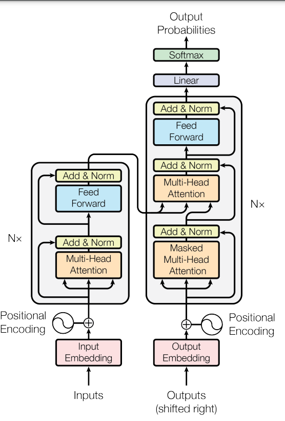
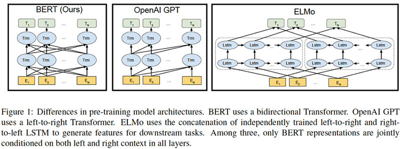

# Text Model

## Overview

Text-based classification models set complex problems for Machine Learning. This is explainable through the nature of context involved in sentences. In ML models responsible for translating text, the context of previous words in the sentence influences the following word.

For example:
When translating the english word 'lean' into another language, the context of the surrounding words influence the translation. If it were to be 'I think I'm going to lean against the car instead', the translation model only understands which word to translate into through the words surrounding the word 'lean'.

This creates a complexity in the model, which can be solved in numerous manners. It's understood that we need to enable a memory capacity within our model, and more specifically, within each node. The solution lies with memory nodes or 'cells', which are able to hold state. 

 

## State cells and models

LSTM (Long Short Term Memory) is one example of a so-called 'state' cell, and its architecture is the following:

This node contains 3 pathways. There is an input and output stream, and within the node there are sigmoid and tanh functions. The sigmoid functions are used to determine which information is to be kept or forgotten, and the tanh function is used to determine the new information to be added to the cell. The output stream is used to determine which information is to be outputted from the cell. The input stream is used to determine which information is to be added to the cell.

Another example of a method used to build context-based models is the Transformer model. The Transformer model uses an Attention mechanism to build relations between nodes. Within an RNN, attention mechanisms are used for an output cell to get information from the state of a specific input cell, but the nature of RNNs means there is high computation involved due to the recurrence in the model. With the Transformer model, attention mechanisms are applied throughout, on each node, which means the computation is limited as each state is always accessible to each of the nodes.

Attention mechanisms allow for the entire input sequence's states to be accessible with relative weights. These attention mechanisms are the focus of the Transformer model, with the idea being that the decoder is able to focus on the important part of the input sequence through using the information available in these hidden states. Values and keys are output from the encoding of the source sentence, and queries are output from the encoding of the target sentence. The dot product of the query vectors are calculated against each of the keys, and the key which most aligns with the query

The queries are then used to calculate the attention weights, which are then used to calculate the context vector. The context vector is then used to calculate the output of the decoder.

 

Transformer model architecture

On the left-hand side are the input nodes (encoders), and on the right, the output nodes (decoders).

 

## BERT overview

Because of the capabilities of the Transformer model, it is an ideal learning model for Natural Language Processing (NLP). The Bidirectional Encoder Representations from Transformers (BERT) is one such NLP model where Transformers have been utilised. BERT is a framework of which implementations are available on Tensorflow hub and provides dense vector representations for natural language by using a deep, pre-trained neural network with the Transformer architecture, trained on a very big model (24 Transformer blocks, 1024-hidden, 340M parameters) using a 3.3 billion word corpus.

With BERT's architecture, it's clear that it takes quite a lot of time to train, which makes it an expensive choice. With NLP models, however, this type of expensive calculation is often necessary to obtain optimised predictions.

 

## Data

The data used for this project is the MBIC dataset, which is a dataset of 1700 articles, each with a label of either 'bias' or 'not-biased'. The dataset is available on Kaggle, and can be found [here](https://www.kaggle.com/datasets/timospinde/mbic-a-media-bias-annotation-dataset).

This dataset is quite unique in that it includes data about the annotators themselves. These features are included in the dataset:
*'sentence', 'url', 'topic', 'type', 'bias', 'label_opinion', 'article', outlet, and biased_words*

 

## Model

The model used for this project is a BERT model, which is available on Tensorflow Hub. The model is a BERT-base model, and has 12 Layers, 768 Hidden, and 12 Attention heads. The model is available on Tensorflow Hub, which hosts a [collection](https://tfhub.dev/google/collections/bert/1) of models openly available for training. The model we've selected and use in this project can be found [here](https://tfhub.dev/tensorflow/bert_en_uncased_L-12_H-768_A-12/1). (*placeholder*)

This model has shown accuracy of 64% on both the training and the test and validation data. This is sub-optimal results considering our project-goal of 85% accuracy, and we endeavour to improve this performance during *Sprint 4*, which starts on 19th December 2022.
